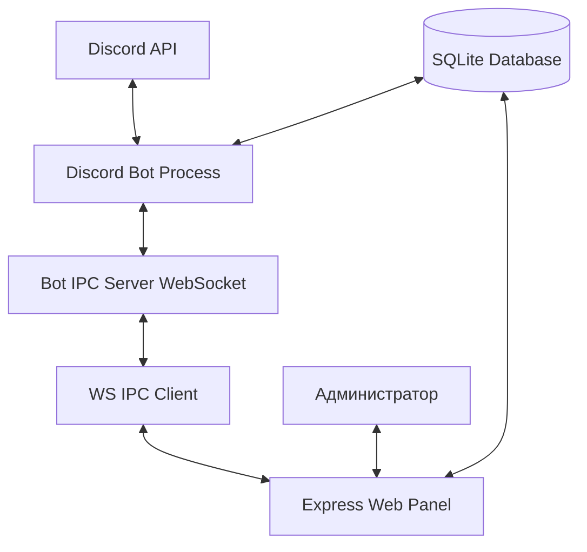

<video src="https://github.com/user-attachments/assets/6a3043ad-4abe-48e3-80f3-4c5ddb14db2f" loop></video>

## Koyomi

Это многофункциональный Discord-бот и веб-панель администрирования, работающие в связке через WebSocket IPC. Проект автоматизирует модерацию серверов, управление динамическими голосовыми каналами, разметку ролей, содержит развлекательные мини-игры и интеграцию с ИИ-моделями Google Gemini с пулом API-ключей. 

Отличительной особенностью бота является модуль автоматического анализа логов краша Minecraft, который парсит прикрепленные файлы логов в каналах поддержки, выявляет конфликты модов, несовместимые версии Java и предлагает решения со ссылками на Modrinth API.

## Архитектура системы



### Технологический стек
* **Платформа:** Node.js
* **API клиент:** Discord.js v14
* **База данных:** SQLite через Sequelize ORM
* **Миграции:** Umzug
* **Веб-сервер:** Express, Passport.js (авторизация через Discord OAuth2), EJS (шаблонизатор)
* **Межпроцессное взаимодействие (IPC):** WebSocket (библиотека ws)
* **ИИ интеграция:** Google GenAI SDK
* **Прочее:** Canvas (генерация изображений семейных древ, капчи, графики логов)

## Установка

### Требования к окружению
* Node.js версии 18 или выше.
* Инструменты сборки C++ (build-essential, python, gyp) для компиляции библиотеки `canvas`.

### Инструкция по развертыванию

1. Клонируйте репозиторий с исходным кодом.
2. Установите зависимости в корневом каталоге проекта:
   ```bash
   npm install
   ```
3. Установите зависимости веб-панели (при необходимости обособленной разработки):
   ```bash
   cd panel
   npm install
   cd ..
   ```
4. Настройте конфигурационный файл окружения. Скопируйте шаблон:
   ```bash
   cp .env.example .env
   ```
   Заполните все обязательные переменные в файле `.env` (описание переменных приведено в разделе «Конфигурация»).
5. Создайте пустой файл конфигурации `config.json` в корневой директории для хранения приватных списков доступа:
   ```json
   {
     "privateAccess": ["ID_ПОЛЬЗОВАТЕЛЯ_РАЗРАБОТЧИКА"],
     "bot_log_channel": "ID_КАНАЛА_ДЛЯ_ЛОГОВ_БОТА"
   }
   ```

## Использование

Запуск бота и интегрированной веб-панели производится одной командой из корневой директории:

```bash
npm start
```

При запуске выполняются следующие автоматические процессы:
1. Инициализируется подключение к базе данных SQLite (`database/main.db`).
2. Проверяются и применяются недостающие миграции из папки `migrations/` с помощью Umzug.
3. Регистрируются слэш-команды в Discord API (глобально или локально в зависимости от переменной `DEV` в `.env`).
4. Поднимается WebSocket IPC сервер для связи с панелью.
5. Запускается Express веб-сервер панели управления (по умолчанию доступен на `http://localhost:6969`).

## Конфигурация

### Переменные окружения (.env)

| Переменная | Описание | Пример |
|---|---|---|
| `token` | Токен авторизации Discord бота | `MTIzeD...` |
| `clientId` | ID Discord приложения (бота) | `1312124121978765393` |
| `clientSecret` | Секретный ключ Discord приложения | `a1b2c3d4...` |
| `redirectUrl` | URL-адрес перенаправления для OAuth2 авторизации веб-панели | `http://localhost:6969` |
| `ENCRYPTION_KEY` | Hex-ключ длиной 32 байта (64 символа) для шифрования токенов Gemini в БД | `8f3e2a...` (генерируется через crypto.randomBytes) |
| `WS_PORT` | Порт WebSocket IPC сервера взаимодействия бота и панели | `8765` |
| `PORT` | Порт веб-интерфейса панели управления | `6969` |
| `DEV` | Флаг режима разработки (при `true` команды деплоятся только на тестовый сервер) | `false` |
| `DEV_SERVER_ID` | ID тестового Discord-сервера для моментального деплоя команд | `1264316836414226464` |
| `gemini_api_key` | Резервный/системный API-ключ Google Gemini по умолчанию | `AIzaSy...` |
| `gemini_api_key_1` | Первый ключ пула Gemini для распределения лимитов | `AIzaSy...` |
| `gemini_api_key_N` | Последующие ключи пула (индексация по порядку от 1 до N) | `AIzaSy...` |

### Менеджер ключей ИИ (lib/ApikeyManager)
Для тонкой настройки распределения запросов между ключами Gemini можно использовать файл конфигурации ключей. Он парсится модулем `apikeyParser.js`.
Формат строки файла конфигурации ключей:
```txt
API_KEY|limit=ЗАПРОСОВ_В_МИНУТУ|cooldown=ВРЕМЯ_БЛОКИРОВКИ_ПРИ_429|priority=ПРИОРИТЕТ
```
Пример:
```txt
AIzaSyD-12345|limit=5|cooldown=60s|priority=2
AIzaSyD-67890|limit=15|cooldown=5m|priority=1
```

## Лицензия

Основной проект распространяется под лицензией **ARR (All Rights Reserved)**.
Компонент `lib/ApikeyManager` распространяется под лицензией **MIT**.