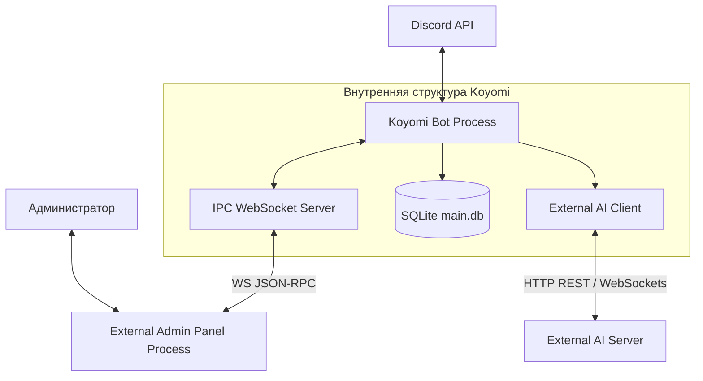

# План рефакторинга: Декуплинг, унифицированная архитектура и типизация

Этот документ описывает стратегию реструктуризации проекта Koyomi. Рефакторинг разделен на подготовительный этап декуплинга (очистки кодовой базы от несвязанного функционала) и последующий переход к унифицированной архитектуре обработки команд с использованием статической типизации.

---

## Целевая архитектура распределенной системы

После рефакторинга система переходит от монолитной структуры к сервисно-ориентированной модели из трех независимых компонентов:



---

## Этапы выполнения рефакторинга

### Фаза 0: Декуплинг и очистка кодовой базы (Подготовительный этап)

Цель этапа — изолировать ядро бота от веб-интерфейса и тяжелой логики ИИ-провайдера.

#### 1. Выделение веб-панели (`panel/`) в отдельный репозиторий
*   **Изоляция зависимостей:** Удаление из `package.json` основного проекта пакетов `express`, `passport`, `passport-discord`, `express-session`, `ejs`.
*   **Стандартизация IPC:** Фиксация протокола взаимодействия между `bot-ipc-server.js` (остается в боте) и `panel/ipc-client.js` (переносится в репозиторий панели). Все запросы приводятся к строгому JSON-RPC-подобному формату:
    ```json
    {
      "requestId": 1,
      "action": "executeAction",
      "data": {
        "guildId": "123456",
        "actionType": "mute",
        "params": { "userId": "7890", "duration": 3600, "reason": "text" }
      }
    }
    ```

#### 2. Удаление встроенного ИИ-модуля и менеджера ключей
*   **Удаление файлов:** Полное удаление `/commands/forFunOnly/gemini.js` и директории `/lib/ApikeyManager/`.
*   **Очистка схемы БД:** Удаление из `utils/db/models.js` и `services/DatabaseService.js` таблиц и методов, связанных с Gemini:
    *   `GeminiUserSetting`
    *   `GeminiSafetySetting`
    *   `GeminiToken`
*   **Реализация `ExternalAiClient`:** Создание легковесного сервиса `services/ExternalAiClient.js` для отправки запросов во внешнюю систему (например, Ai Server). Этот сервис будет использоваться исключительно для генерации пояснений к логам краша Minecraft в модуле поддержки, если это необходимо.

---

### Фаза 1: Внедрение унифицированной типизации и инфраструктуры

Цель этапа — создание базовых сервисов обработки команд и описание типов.

#### 1. Инициализация контрактов типизации
*   Настройка `types.d.ts` для описания интерфейса `KoyomiInteraction` и `KoyomiInteractionOptions`.
*   Интеграция JSDoc для всех команд с приведением типов к единому знаменателю.

#### 2. Развертывание инфраструктурных сервисов
*   **CommandIndexService:** Построение кэшированного индекса команд, их субкоманд и групп для поиска за $O(1)$.
*   **CommandValidationService:** Валидация прав доступа пользователя, кулдаунов и проверки глобального/локального отключения команд через таблицу `DisabledCommand`.
*   **CommandLocalizationService:** Централизованное определение локали взаимодействия на основе настроек гильдии (`GuildSetting.language`).
*   **CommandErrorHandler:** Единая точка перехвата ошибок исполнения, логирования в системный канал Discord и отправки стандартизированных уведомлений пользователям.
*   **CommandExecutionService:** Координатор, запускающий цепочку: Валидация -> Локализация -> Исполнение.

---

### Фаза 2: Унификация обработчиков событий

Перенос логики диспетчеризации из файлов событий в новые инфраструктурные сервисы.

#### 1. Рефакторинг `interactionCreate.js`
*   Удаление дублирующегося кода проверки кулдаунов и блокировок.
*   Делегирование исполнения сервису `CommandExecutionService`.

#### 2. Рефакторинг `messageCreate.js` и интеграция `MessageInteraction`
*   Использование `CommandIndexService` для разбора префиксных сообщений.
*   Использование класса `MessageInteraction` из `core/utils/messageToInteraction.js` для эмуляции интерфейса `ChatInputCommandInteraction`.
*   Парсинг аргументов с поддержкой кавычек (строки с пробелами) и приведение их к типам через методы `options.getString`, `options.getMember` и т.д.

---

### Фаза 3: Оптимизация кэширования и тестирование

#### 1. Кэширование конфигураций БД
*   Оптимизация `DatabaseService` для кэширования настроек серверов (`GuildSetting`) и ограничений команд (`DisabledCommand`) с целью снижения дискового ввода-вывода SQLite.

#### 2. Модульное и интеграционное тестирование
*   Рефакторинг `tests/test-commands.js` для проверки как слэш-команд, так и их префиксных аналогов через эмуляцию `MessageInteraction`.
*   Проверка корректности работы внешнего WebSocket IPC при отключенной и подключенной веб-панели (резервные заглушки данных).

---

## Сравнение архитектурных изменений

| Компонент / Проблема | Текущая реализация | После рефакторинга |
|---|---|---|
| **Размер дистрибутива** | Бот содержит веб-сервер, шаблоны, стили, логику авторизации. | Бот содержит только ядро, команды Discord и IPC-сервер. |
| **Управление ИИ** | Сложная логика ротации API-ключей и хранения токенов внутри БД бота. | Делегировано внешнему ИИ-серверу по API. Бот отправляет только сырой контекст. |
| **Поиск субкоманд** | Полный перебор массива опций при каждом префиксном вызове. | Быстрый поиск по предварительно проиндексированной карте субкоманд за $O(1)$. |
| **Обработка ошибок** | Индивидуальные блоки try/catch в файлах событий с дублированием кода. | Централизованный перехват через `CommandErrorHandler` с отправкой логов в выделенный канал. |
| **Связанность кода** | Прямая зависимость команд от конкретных типов событий Discord (Interaction/Message). | Полная изоляция команд через абстрактный слой `KoyomiInteraction`. |