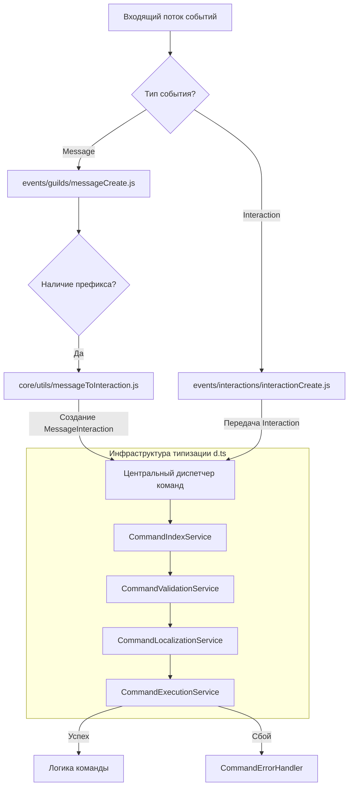
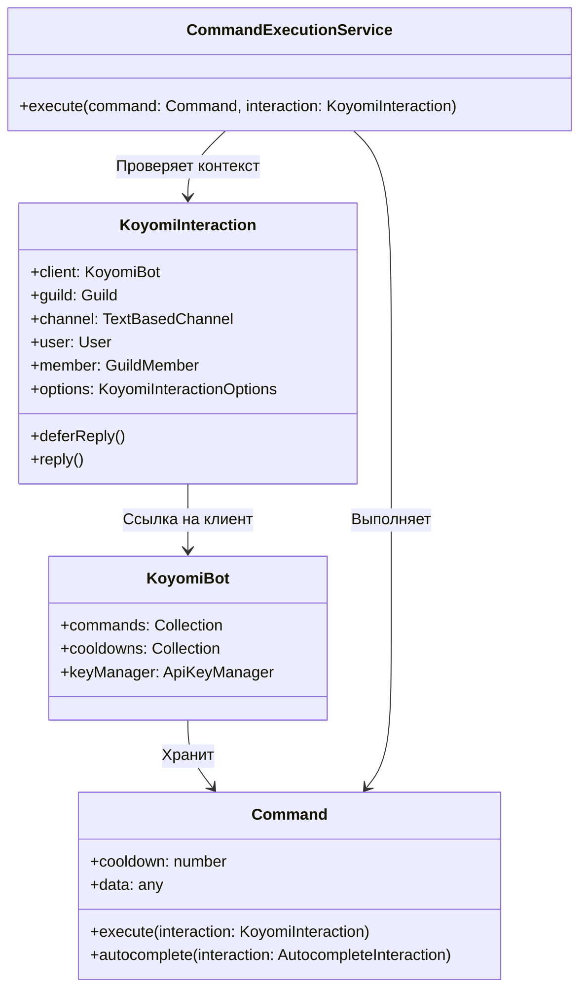

# План рефакторинга: Унифицированная архитектура команд и типизация

Этот документ описывает переход к единому интерфейсу обработки команд бота. Цель рефакторинга — устранить дублирование кода между слэш-командами и командами с префиксом, оптимизировать алгоритмы поиска и внедрить статическую типизацию с использованием файлов описания типов `.d.ts` для предотвращения ошибок на этапе разработки.

---

## Архитектура системы обработки команд

Схема ниже иллюстрирует, как входящие события разного типа приводятся к единому программному контракту и обрабатываются общим набором сервисов.

---

## Роль статической типизации в процессе рефакторинга

Использование динамического языка JavaScript в сочетании со сложными объектами библиотеки `discord.js` часто приводит к ошибкам несоответствия типов при передаче параметров. Внедрение `types.d.ts` решает следующие задачи:

1. **Гарантия интерфейса взаимодействия**: Слой `MessageInteraction` должен полностью эмулировать стандартный `ChatInputCommandInteraction`. Описание их общего подмножества методов в интерфейсе `KoyomiInteraction` позволяет разрабатывать код команд без необходимости разделения логики под каждый источник события.
2. **Контроль опций аргументов**: Интерфейс `KoyomiInteractionOptions` гарантирует, что методы получения аргументов (например, `getString`, `getInteger`) возвращают ожидаемые типы данных или `null`, снижая вероятность падения программы из-за необработанных значений.
3. **Безопасный рефакторинг сервисов**: IDE осуществляет статическую проверку сигнатур функций в новых сервисах, предотвращая ситуации, когда разработчик передает некорректные структуры данных в `CommandValidationService` или `CommandExecutionService`.

Связи контрактов типов представлены на схеме классов ниже:

---

## Этапы выполнения рефакторинга

### Фаза 1: Внедрение сервисов и деклараций типов
На этом этапе создаются базовые инфраструктурные элементы и подключаются типы.

1. **Инициализация контрактов**: Подключение `types.d.ts` и настройка `jsconfig.json` в корневой директории проекта.
2. **CommandIndexService**: Построение карты соответствия команд, их групп и субкоманд для поиска за время $O(1)$ вместо полного перебора.
3. **CommandValidationService**: Инкапсуляция логики проверки кулдаунов, ограничений доступа и отключенных команд.
4. **CommandLocalizationService**: Централизованный выбор языка на основе настроек гильдии или региональных параметров инициатора взаимодействия.
5. **CommandErrorHandler**: Единая точка перехвата ошибок исполнения, логирования в системный канал бота и отправки уведомления пользователю.
6. **CommandExecutionService**: Координация работы валидации, локализации и вызова метода `execute` команды.

### Фаза 2: Унификация обработчиков событий
Перенос логики диспетчеризации из файлов событий в новые сервисы.

* **Рефакторинг `interactionCreate.js`**:
  * Сокращение объема файла за счет делегирования логики проверок в `CommandValidationService`.
  * Типизация аргументов через JSDoc аннотации (`@param {import('../../types').KoyomiInteraction} interaction`).
* **Рефакторинг `messageCreate.js`**:
  * Замена устаревшего поиска команд на вызовы `CommandIndexService`.
  * Интеграция обертки `MessageInteraction` для приведения префиксных команд к единому формату данных.

### Фаза 3: Оптимизация поиска и кэширования
* Настройка механизмов кэширования конфигураций гильдий в `DatabaseService` для минимизации нагрузки на базу данных SQLite.
* Проверка типов возвращаемых значений аргументов в `MessageCommandOptions` на соответствие спецификации `KoyomiInteractionOptions`.

---

## Архитектурные изменения файлов

| Компонент / Проблема | Прошлый подход | Планируемое решение | Преимущество |
|---|---|---|---|
| Дублирование кода проверок | Около 300 строк одинаковых проверок в `messageCreate` и `interactionCreate` | Вынос проверок в `CommandValidationService` | Сокращение кодовой базы, единая точка изменения правил валидации |
| Поиск субкоманд | Полный перебор массива опций с временной сложностью $O(n \cdot m)$ | Кэшированный индекс в `CommandIndexService` | Быстрый поиск команд за $O(1)$ |
| Неконсистентность типов | Неявные типы параметров, приводящие к ошибкам во время работы | Использование контрактов `types.d.ts` и JSDoc | Выявление несоответствий типов на этапе написания кода в IDE |
| Локализация ответов | Копирование блоков получения языка в каждом файле отдельно | Подключение `CommandLocalizationService` | Единообразная обработка языковых пакетов во всех интерфейсах |

---

## Стратегия проверки и тестирования

Каждая фаза рефакторинга должна сопровождаться проверкой следующих сценариев:

1. **Статическая верификация**:
   * Отсутствие ошибок типизации в IDE при активации режима `"checkJs": true`.
   * Соответствие кастомного `MessageInteraction` методам оригинального интерфейса `discord.js`.
2. **Исполнение слэш-команд**:
   * Корректная обработка опциональных и обязательных аргументов.
   * Работа механизма автодополнения (autocomplete).
3. **Исполнение префиксных команд**:
   * Разбор аргументов с пробелами внутри кавычек.
   * Изолированное выполнение команд, имеющих одинаковые имена с субкомандами других модулей.
4. **Отказоустойчивость**:
   * Перехват ошибок внутри команд сервисом `CommandErrorHandler` с последующей отправкой лога в `bot_log_channel`.

---

## Временная оценка

| Фаза рефакторинга | Оценка трудозатрат | Основные задачи |
|---|---|---|
| Слой типов и `CommandIndexService` | 2–3 дня | Создание `types.d.ts`, индексация дерева команд |
| Сервисы валидации и исполнения | 3 дня | Разработка `CommandValidationService`, `CommandExecutionService` |
| Адаптация обработчиков событий | 4 дня | Переписывание `interactionCreate.js` и `messageCreate.js` |
| Оптимизация кэширования и тестирование | 3 дня | Внедрение кэша в `DatabaseService`, тестирование краевых сценариев |

*Примечание: Приведенные сроки являются ориентировочными и могут изменяться в зависимости от текущего состояния связей со сторонними API.*